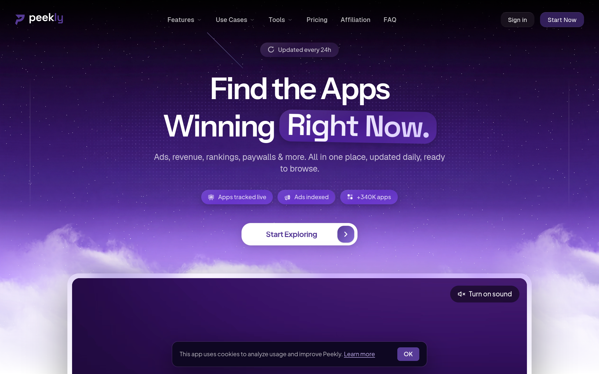

# peekly Design System

You are building UI for **peekly**. Light-themed, cool palette, sans-serif typography (Space Grotesk), compact density on a 4px grid, expressive motion.

## Visual Reference

**IMPORTANT**: Study ALL screenshots below before writing any UI. Match colors, typography, spacing, layout, and motion exactly as shown.

### Homepage



> Read `references/DESIGN.md` for full token details.

## Design Philosophy

- **Layered depth** — use shadow tokens to create a sense of physical layering. Each elevation level has a specific shadow.
- **Gradient accents** — gradients are used thoughtfully for emphasis, not decoration.
- **Type pairing** — Space Grotesk for body/UI text, Plus Jakarta Sans for headings/display. Never introduce a third typeface.
- **compact density** — 4px base grid. Every dimension is a multiple of 4.
- **cool palette** — the color temperature runs cool, matching the sans-serif typography.
- **Restrained accent** — `#573b97` is the only pop of color. Used exclusively for CTAs, links, focus rings, and active states.
- **Expressive motion** — animations are an integral part of the experience. Use spring physics and layout animations.

## Color System

### Core Palette

| Role | Token | Hex | Use |
|------|-------|-----|-----|
| Background | `--background` | `#ffffff` | Page/app background |
| Text Primary | `--text-primary` | `#000000` | Headings, body text |
| Accent | `--accent` | `#573b97` | CTAs, links, focus rings |

### Status Colors

| Status | Hex | Use |
|--------|-----|-----|
| Success | `#72fd4e` | Confirmations, positive trends |
| Warning | `#f99c00` | Caution states, pending items |
| Danger | `#e11d48` | Errors, destructive actions |

### Extended Palette

- `#8a6cd9`
- `#cd8ef8`
- **color-zinc-950:** `#0f0618` — Deep background layer or shadow color
- **tw-ring-color:** `#c0392b` — Warm accent — hover glow or decorative highlight
- `#1b122c`
- **color-purple-100:** `#f3e8ff` — Light surface or highlight color
- **foreground:** `#0a0a0a` — Deep background layer or shadow color
- `#dcc8ff` — Light surface or highlight color

### CSS Variable Tokens

```css
--background: #fafafa;
--foreground: #0a0a0a;
--accent: #573b97;
--accent-soft: #efebf7;
--background: #fafafa;
--foreground: #0a0a0a;
--accent: #573b97;
--accent-soft: #efebf7;
--background: #fafafa;
--foreground: #0a0a0a;
--accent: #573b97;
--accent-soft: #efebf7;
--background: #fafafa;
--foreground: #0a0a0a;
--accent: #573b97;
--accent-soft: #efebf7;
--background: #fafafa;
--foreground: #0a0a0a;
--accent: #573b97;
--accent-soft: #efebf7;
```

## Typography

### Font Stack

- **Space Grotesk** — Heading 1, Heading 2, Heading 3
- **Plus Jakarta Sans** — Body, Caption
- **Geist Mono** — Code

### Font Sources

```css
@font-face {
  font-family: "Plus Jakarta Sans";
  src: url("fonts/PlusJakartaSans-Bold.ttf") format("truetype");
  font-weight: 700;
}
@font-face {
  font-family: "Plus Jakarta Sans";
  src: url("fonts/PlusJakartaSans-Regular.ttf") format("truetype");
  font-weight: 400;
}
@font-face {
  font-family: "Space Grotesk";
  src: url("fonts/SpaceGrotesk-Bold.ttf") format("truetype");
  font-weight: 700;
}
@font-face {
  font-family: "Space Grotesk";
  src: url("fonts/SpaceGrotesk-Regular.ttf") format("truetype");
  font-weight: 400;
}
@font-face {
  font-family: "Geist Mono";
  src: url("fonts/GeistMono-Bold.ttf") format("truetype");
  font-weight: 700;
}
@font-face {
  font-family: "Geist Mono";
  src: url("fonts/GeistMono-Regular.ttf") format("truetype");
  font-weight: 400;
}
@font-face {
  font-family: "Instrument Sans";
  src: url("fonts/InstrumentSans-Bold.ttf") format("truetype");
  font-weight: 700;
}
@font-face {
  font-family: "Instrument Sans";
  src: url("fonts/InstrumentSans-Regular.ttf") format("truetype");
  font-weight: 400;
}
@font-face {
  font-family: "GeistSans";
  src: url("fonts/GeistSans-100.woff2") format("woff2");
  font-weight: 100;
}
```

### Type Scale

| Role | Family | Size | Weight |
|------|--------|------|--------|
| Heading 1 | Space Grotesk | clamp(4.5rem,14vw,7.5rem) | 700 |
| Heading 2 | Space Grotesk | 3.6rem | 700 |
| Heading 3 | Space Grotesk | 3rem | 700 |
| Body | Plus Jakarta Sans | 12.5px | 400 |
| Caption | Plus Jakarta Sans | 16px | 400 |
| Code | Geist Mono | 14px | 400 |

### Typography Rules

- Body/UI: **Space Grotesk**, Headings: **Plus Jakarta Sans** — these are the only display fonts
- Max 3-4 font sizes per screen
- Headings: weight 600-700, body: weight 400
- Use color and opacity for text hierarchy, not additional font sizes
- Line height: 1.5 for body, 1.2 for headings

## Spacing & Layout

### Base Grid: 4px

Every dimension (margin, padding, gap, width, height) must be a multiple of **4px**.

### Spacing Scale

`2, 4, 6, 8, 18, 20, 34, 50, 60, 136, 140` px

### Spacing as Meaning

| Spacing | Use |
|---------|-----|
| 4-8px | Tight: related items (icon + label, avatar + name) |
| 12-16px | Medium: between groups within a section |
| 24-32px | Wide: between distinct sections |
| 48px+ | Vast: major page section breaks |

### Border Radius

Scale: `inherit, .25rem, .375rem, .5rem, .75rem, 1rem, 1.15rem, 1.35rem, 1.4rem, 1.5rem, 1.6rem, 1.75rem, 2rem, 2px, 2.3rem, 2.5rem, 2.6rem, 3px, 4px, 5px, 6px, 8px, 10px, 11px, 12px, 14px, 16px, 18px, 20px, 22px, 24px, 26px, 28px, 999px`
Default: `3px`

### Container

Max-width: `1023px`, centered with auto margins.

### Breakpoints

| Name | Value |
|------|-------|
| sm | 40rem |
| md | 48rem |
| lg | 64rem |
| xl | 80rem |
| 2xl | 96rem |
| xs | 380px |
| sm | 639px |
| sm | 640px |
| md | 767px |
| lg | 1023px |
| lg | 1024px |
| 2xl | 1400px |

Mobile-first: design for small screens, layer on responsive overrides.

## Component Patterns

### Card

```css
.card {
  background: #ffffff;
  border-radius: 3px;
  padding: 18px;
  box-shadow: 4px 4px 4px #0000000d,inset 0 1px 1px #ffffff38;
}
```

```html
<div class="card">
  <h3>Card Title</h3>
  <p>Card content goes here.</p>
</div>
```

### Button

```css
/* Primary */
.btn-primary {
  background: #573b97;
  color: #000000;
  border-radius: 3px;
  padding: 8px 18px;
  font-weight: 500;
  transition: opacity 150ms ease;
}
.btn-primary:hover { opacity: 0.9; }

/* Ghost */
.btn-ghost {
  background: transparent;
  border: 1px solid #cccccc;
  color: #000000;
  border-radius: 3px;
  padding: 8px 18px;
}
```

```html
<button class="btn-primary">Get Started</button>
<button class="btn-ghost">Learn More</button>
```

### Input

```css
.input {
  background: #ffffff;
  border: 1px solid #cccccc;
  border-radius: 3px;
  padding: 8px 8px;
  color: #000000;
  font-size: 14px;
}
.input:focus { border-color: #573b97; outline: none; }
```

```html
<input class="input" type="text" placeholder="Search..." />
```

### Badge / Chip

```css
.badge {
  display: inline-flex;
  align-items: center;
  padding: 4px 8px;
  border-radius: 9999px;
  font-size: 12px;
  font-weight: 500;
  background: #ffffff;
  color: #000000;
}
```

```html
<span class="badge">New</span>
<span class="badge">Beta</span>
```

### Modal / Dialog

```css
.modal-backdrop { background: rgba(0, 0, 0, 0.6); }
.modal {
  background: #ffffff;
  border-radius: 999px;
  padding: 20px;
  max-width: 480px;
  width: 90vw;
  box-shadow: inset 0 1px #ffffffa6,inset 0-1px #ffffff2e,0 2px 12px #0000000f;
}
```

```html
<div class="modal-backdrop">
  <div class="modal">
    <h2>Dialog Title</h2>
    <p>Dialog content.</p>
    <button class="btn-primary">Confirm</button>
    <button class="btn-ghost">Cancel</button>
  </div>
</div>
```

### Table

```css
.table { width: 100%; border-collapse: collapse; }
.table th {
  text-align: left;
  padding: 8px 8px;
  font-weight: 500;
  font-size: 12px;
  color: #000000;
  text-transform: uppercase;
  letter-spacing: 0.05em;
  border-bottom: 1px solid #cccccc;
}
.table td {
  padding: 8px;
  border-bottom: 1px solid #cccccc;
}
```

```html
<table class="table">
  <thead><tr><th>Name</th><th>Status</th><th>Date</th></tr></thead>
  <tbody>
    <tr><td>Item One</td><td>Active</td><td>Jan 1</td></tr>
    <tr><td>Item Two</td><td>Pending</td><td>Jan 2</td></tr>
  </tbody>
</table>
```

### Navigation

```css
.nav {
  display: flex;
  align-items: center;
  gap: 8px;
  padding: 8px 18px;
}
.nav-link {
  color: #000000;
  padding: 8px 8px;
  border-radius: 3px;
  transition: color 150ms;
}
.nav-link:hover { color: #000000; }
.nav-link.active { color: #573b97; }
```

```html
<nav class="nav">
  <a href="/" class="nav-link active">Home</a>
  <a href="/about" class="nav-link">About</a>
  <a href="/pricing" class="nav-link">Pricing</a>
  <button class="btn-primary" style="margin-left: auto">Get Started</button>
</nav>
```

### Extracted Components

These components were found in the codebase:

**Button** (`html`)

**Navigation** (`html`)

## Page Structure

The following page sections were detected:

- **Navigation** — Top navigation bar (3 items)
- **Hero** — Hero/banner section with headline and CTAs
- **Faq** — FAQ/accordion section
- **Footer** — Page footer with links and info (26 items)

When building pages, follow this section order and structure.

## Animation & Motion

This project uses **expressive motion**. Animations are part of the design language.

### CSS Animations

- `float`
- `marquee`
- `marquee-vertical`
- `feed-side-in`
- `ripple`

### Motion Tokens

- **Duration scale:** `.1s`, `.15s`, `.2s`, `.3s`, `.42s`, `.44s`, `.5s`, `.7s`, `1.1s`, `2.4s`, `3s`, `180ms`, `200ms`, `220ms`
- **Easing functions:** `cubic-bezier(.16,1,.3,1)`, `cubic-bezier(.22,1,.36,1)`, `cubic-bezier(.32,.72,0,1)`, `cubic-bezier(.34,1.24,.5,1)`, `linear`
- **Animated properties:** `box-shadow`, `background`

### Motion Guidelines

- **Duration:** Use values from the duration scale above. Short (.1s) for micro-interactions, long (220ms) for page transitions
- **Easing:** Use `cubic-bezier(.16,1,.3,1)` as the default easing curve
- **Direction:** Elements enter from bottom/right, exit to top/left
- **Reduced motion:** Always respect `prefers-reduced-motion` — disable animations when set

## Depth & Elevation

### Shadow Tokens

- Raised (cards, buttons): `4px 4px 4px #0000000d,inset 0 1px 1px #ffffff38`
- Raised (cards, buttons): `0 2px 8px #00000080`
- Raised (cards, buttons): `0 0 0 6px #cd8ef880`
- Floating (dropdowns, popovers): `inset 0 1px #ffffffa6,inset 0-1px #ffffff2e,0 2px 12px #0000000f`
- Floating (dropdowns, popovers): `inset 0 1px #ffffffbf,inset 0-1px #ffffff38,0 4px 18px #00000014`
- Floating (dropdowns, popovers): `0 0 16px 2px #ffffff24,4px 4px 4px #0000000f,inset 0 1px 1px #ffffff47`

### Z-Index Scale

`0, 1, 2, 3, 4, 5, 10, 11, 12, 20, 30, 40, 50, 60, 70, 100, 120, 121, 200, 300, 400, 1600, 9999`

Use these exact values — never invent z-index values.

## Anti-Patterns (Never Do)

- **No blur effects** — no backdrop-blur, no filter: blur()
- **No zebra striping** — tables and lists use borders for separation
- **No invented colors** — every hex value must come from the palette above
- **No arbitrary spacing** — every dimension is a multiple of 4px
- **No extra fonts** — only Space Grotesk and Plus Jakarta Sans and Geist Mono are allowed
- **No arbitrary border-radius** — use the scale: .25rem, .375rem, .5rem, .75rem, 1rem, 1.15rem, 1.35rem, 1.4rem, 1.5rem, 1.6rem
- **No opacity for disabled states** — use muted colors instead

## Workflow

1. **Read** `references/DESIGN.md` before writing any UI code
2. **Pick colors** from the Color System section — never invent new ones
3. **Set typography** — Space Grotesk, Plus Jakarta Sans, Geist Mono only, using the type scale
4. **Build layout** on the 4px grid — check every margin, padding, gap
5. **Match components** to patterns above before creating new ones
6. **Apply elevation** — use shadow tokens
7. **Validate** — every value traces back to a design token. No magic numbers.

## Brand Spec

- **Favicon:** `/favicon.ico`
- **Site URL:** `https://peekly.app/`
- **Brand color:** `#573b97`
- **Brand typeface:** Space Grotesk

## Quick Reference

```
Background:     #ffffff
Surface:        (not extracted)
Text:           #000000 / (not extracted)
Accent:         #573b97
Border:         (not extracted)
Font:           Space Grotesk
Spacing:        4px grid
Radius:         3px
Components:     7 detected
```

## When to Trigger

Activate this skill when:
- Creating new components, pages, or visual elements for peekly
- Writing CSS, Tailwind classes, styled-components, or inline styles
- Building page layouts, templates, or responsive designs
- Reviewing UI code for design consistency
- The user mentions "peekly" design, style, UI, or theme
- Generating mockups, wireframes, or visual prototypes

---

# Full Reference Files

> Every output file is embedded below. Claude has full design system context from /skills alone.

## Design System Tokens (DESIGN.md)

# peekly DESIGN.md

> Auto-generated design system — reverse-engineered via static analysis by skillui.
> Frameworks: None detected
> Colors: 20 · Fonts: 3 · Components: 7
> Icon library: not detected · State: not detected
> Primary theme: light · Dark mode toggle: no · Motion: expressive

## Visual Reference

**Match this design exactly** — study colors, fonts, spacing, and component shapes before writing any UI code.


---

## 1. Visual Theme & Atmosphere

This is a **light-themed** interface with a cool, approachable feel. The light background emphasizes content clarity. Typography pairs **Plus Jakarta Sans** for display/headings with **Space Grotesk** for body text, creating clear visual hierarchy through type contrast. Spacing follows a **4px base grid** (compact density), with scale: 2, 4, 6, 8, 18, 20, 34, 50px. The accent color **#573b97** anchors interactive elements (buttons, links, focus rings). Motion is expressive — spring physics, layout animations, and staggered reveals are part of the visual language.

---

## 2. Color Palette & Roles

| Token | Hex | Role | Use |
|---|---|---|---|
| tw-ring-offset-color | `#ffffff` | background | Page background, darkest surface |
| color-black | `#000000` | text-primary | Headings and body text |
| accent | `#573b97` | accent | CTAs, links, focus rings, active states |
| danger | `#e11d48` | danger | Error states, destructive actions |
| tw-ring-color | `#72fd4e` | success | Success states, positive indicators |
| color-amber-500 | `#f99c00` | warning | Warning states, caution indicators |
| info | `#8a6cd9` | info | Informational highlights |
| unknown | `#cd8ef8` | unknown | Palette color |
| color-zinc-950 | `#0f0618` | unknown | Palette color |
| tw-ring-color | `#c0392b` | unknown | Palette color |
| unknown | `#1b122c` | unknown | Palette color |
| color-purple-100 | `#f3e8ff` | unknown | Palette color |
| foreground | `#0a0a0a` | unknown | Palette color |
| unknown | `#dcc8ff` | unknown | Palette color |
| unknown | `#f87171` | unknown | Palette color |
| color-slate-200 | `#e2e8f0` | unknown | Palette color |
| unknown | `#f0f1f3` | unknown | Palette color |
| unknown | `#7855be` | unknown | Palette color |
| color-indigo-100 | `#e0e7ff` | unknown | Palette color |
| unknown | `#2a1a49` | unknown | Palette color |

### CSS Variable Tokens

```css
--tw-border-style: solid;
--tw-border-style: dashed;
--background: #fafafa;
--foreground: #0a0a0a;
--accent: #573b97;
--accent-soft: #efebf7;
--tw-border-style: solid;
--tw-border-style: dashed;
--background: #fafafa;
--foreground: #0a0a0a;
--accent: #573b97;
--accent-soft: #efebf7;
--tw-border-style: solid;
--tw-border-style: dashed;
--background: #fafafa;
--foreground: #0a0a0a;
--accent: #573b97;
--accent-soft: #efebf7;
--tw-border-style: solid;
--tw-border-style: dashed;
```


---

## 3. Typography Rules

**Font Stack:**
- **Space Grotesk** — Heading 1, Heading 2, Heading 3
- **Plus Jakarta Sans** — Body, Caption
- **Geist Mono** — Code

**Font Sources:**

```css
@font-face {
  font-family: "Plus Jakarta Sans";
  src: url("fonts/PlusJakartaSans-Bold.ttf") format("truetype");
  font-weight: 700;
}
@font-face {
  font-family: "Plus Jakarta Sans";
  src: url("fonts/PlusJakartaSans-Regular.ttf") format("truetype");
  font-weight: 400;
}
@font-face {
  font-family: "Space Grotesk";
  src: url("fonts/SpaceGrotesk-Bold.ttf") format("truetype");
  font-weight: 700;
}
@font-face {
  font-family: "Space Grotesk";
  src: url("fonts/SpaceGrotesk-Regular.ttf") format("truetype");
  font-weight: 400;
}
@font-face {
  font-family: "Geist Mono";
  src: url("fonts/GeistMono-Bold.ttf") format("truetype");
  font-weight: 700;
}
@font-face {
  font-family: "Geist Mono";
  src: url("fonts/GeistMono-Regular.ttf") format("truetype");
  font-weight: 400;
}
@font-face {
  font-family: "Instrument Sans";
  src: url("fonts/InstrumentSans-Bold.ttf") format("truetype");
  font-weight: 700;
}
@font-face {
  font-family: "Instrument Sans";
  src: url("fonts/InstrumentSans-Regular.ttf") format("truetype");
  font-weight: 400;
}
@font-face {
  font-family: "GeistSans";
  src: url("fonts/GeistSans-100.woff2") format("woff2");
  font-weight: 100;
}
```

| Role | Font | Size | Weight |
|---|---|---|---|
| Heading 1 | Space Grotesk | clamp(4.5rem,14vw,7.5rem) | 700 |
| Heading 2 | Space Grotesk | 3.6rem | 700 |
| Heading 3 | Space Grotesk | 3rem | 700 |
| Body | Plus Jakarta Sans | 12.5px | 400 |
| Caption | Plus Jakarta Sans | 16px | 400 |
| Code | Geist Mono | 14px | 400 |

**Typographic Rules:**
- Limit to 3 font families max per screen
- Use **Space Grotesk** for body/UI text, **Plus Jakarta Sans** for display/headings
- Maintain consistent hierarchy: no more than 3-4 font sizes per screen
- Headings use bold (600-700), body uses regular (400)
- Line height: 1.5 for body text, 1.2 for headings
- Use color and opacity for secondary hierarchy, not additional font sizes


---

## 4. Component Stylings

### Layout (1)

**Footer** — `html`

### Navigation (1)

**Navigation** — `html`

### Data Display (1)

**List** — `html`

### Data Input (1)

**Button** — `html`
- Animation: 

### Media (3)

**Image** — `html`

**Icon** — `html`

**Map/Canvas** — `html`


---

## 5. Layout Principles

- **Base spacing unit:** 4px
- **Spacing scale:** 2, 4, 6, 8, 18, 20, 34, 50, 60, 136, 140
- **Border radius:** inherit, .25rem, .375rem, .5rem, .75rem, 1rem, 1.15rem, 1.35rem, 1.4rem, 1.5rem, 1.6rem, 1.75rem, 2rem, 2px, 2.3rem, 2.5rem, 2.6rem, 3px, 4px, 5px, 6px, 8px, 10px, 11px, 12px, 14px, 16px, 18px, 20px, 22px, 24px, 26px, 28px, 999px
- **Max content width:** 1023px

**Spacing as Meaning:**
| Spacing | Use |
|---|---|
| 4-8px | Tight: related items within a group |
| 12-16px | Medium: between groups |
| 24-32px | Wide: between sections |
| 48px+ | Vast: major section breaks |


---

## 6. Depth & Elevation

### Raised — cards, buttons, interactive elements

- `4px 4px 4px #0000000d,inset 0 1px 1px #ffffff38`
- `0 2px 8px #00000080`
- `0 0 0 6px #cd8ef880`

### Floating — dropdowns, popovers, modals

- `inset 0 1px #ffffffa6,inset 0-1px #ffffff2e,0 2px 12px #0000000f`
- `inset 0 1px #ffffffbf,inset 0-1px #ffffff38,0 4px 18px #00000014`
- `0 0 16px 2px #ffffff24,4px 4px 4px #0000000f,inset 0 1px 1px #ffffff47`

### Overlay — full-screen overlays, top-level dialogs

- `inset 0 1px 1px #fffffff2,inset 0-1px 1px #ffffff80,inset 1px 0 1px #fff6,inset -1px 0 1px #fff6,0 1px 2px #0000000a,0 16px 44px -12px #00000057`
- `0 0#8a6cd900,0 6px 24px #0000002e`
- `0 0 26px 4px #8a6cd98c,0 6px 24px #0000002e`

### Z-Index Scale

`0, 1, 2, 3, 4, 5, 10, 11, 12, 20, 30, 40, 50, 60, 70, 100, 120, 121, 200, 300, 400, 1600, 9999`


---

## 7. Animation & Motion

This project uses **expressive motion**. Animations are an integral part of the experience.

### CSS Animations

- `@keyframes float`
- `@keyframes marquee`
- `@keyframes marquee-vertical`
- `@keyframes feed-side-in`
- `@keyframes ripple`
- `@keyframes ripple-glass-violet`
- `@keyframes ripple-logo-out`
- `@keyframes panel-slide-in`

### Animated Components

- **Button**: 

### Motion Guidelines

- Duration: 150-300ms for micro-interactions, 300-500ms for page transitions
- Easing: `ease-out` for enters, `ease-in` for exits
- Always respect `prefers-reduced-motion`


---

## 8. Do's and Don'ts

### Do's

- Use `#573b97` for interactive elements (buttons, links, focus rings)
- Use `#ffffff` as the primary page background
- Pair **Space Grotesk** (body) with **Plus Jakarta Sans** (display) — these are the only allowed fonts
- Follow the **4px** spacing grid for all margins, padding, and gaps
- Use the defined shadow tokens for elevation — see Section 6
- Use border-radius from the scale: inherit, .25rem, .375rem, .5rem, .75rem
- Reuse existing components from Section 4 before creating new ones

### Don'ts

- Don't introduce colors outside this palette — extend the design tokens first
- Don't introduce additional font families beyond Space Grotesk and Plus Jakarta Sans and Geist Mono
- Don't use arbitrary spacing values — stick to multiples of 4px
- Don't create custom box-shadow values outside the system tokens
- Don't use arbitrary border-radius values — pick from the defined scale
- Don't duplicate component patterns — check Section 4 first
- Don't use backdrop-blur or blur effects

### Anti-Patterns (detected from codebase)

- No blur or backdrop-blur effects
- No zebra striping on tables/lists


---

## 9. Responsive Behavior

| Name | Value | Source |
|---|---|---|
| sm | 40rem | css |
| md | 48rem | css |
| lg | 64rem | css |
| xl | 80rem | css |
| 2xl | 96rem | css |
| xs | 380px | css |
| sm | 639px | css |
| sm | 640px | css |
| md | 767px | css |
| lg | 1023px | css |
| lg | 1024px | css |
| 2xl | 1400px | css |

**Approach:** Use `@media (min-width: ...)` queries matching the breakpoints above.


---

## 10. Agent Prompt Guide

Use these as starting points when building new UI:

### Build a Card

```
Background: #ffffff
Border: 1px solid var(--border)
Radius: 3px
Padding: 18px
Font: Space Grotesk
Use shadow tokens from Section 6.
```

### Build a Button

```
Primary: bg #573b97, text white
Ghost: bg transparent, border var(--border)
Padding: 8px 18px
Radius: 3px
Hover: opacity 0.9 or lighter shade
Focus: ring with #573b97
```

### Build a Page Layout

```
Background: #ffffff
Max-width: 1023px, centered
Grid: 4px base
Responsive: mobile-first, breakpoints from Section 9
```

### Build a Stats Card

```
Surface: #ffffff
Label: var(--text-muted) (muted, 12px, uppercase)
Value: #000000 (primary, 24-32px, bold)
Status: use success/warning/danger from Section 2
```

### Build a Form

```
Input bg: #ffffff
Input border: 1px solid var(--border)
Focus: border-color #573b97
Label: var(--text-muted) 12px
Spacing: 18px between fields
Radius: 3px
```

### General Component

```
1. Read DESIGN.md Sections 2-6 for tokens
2. Colors: only from palette
3. Font: Space Grotesk, type scale from Section 3
4. Spacing: 4px grid
5. Components: match patterns from Section 4
6. Elevation: shadow tokens
```

## Bundled Fonts (fonts/)

The following font files are bundled in the `fonts/` directory:

- `fonts/GeistMono-Black.ttf`
- `fonts/GeistMono-Bold.ttf`
- `fonts/GeistMono-ExtraBold.ttf`
- `fonts/GeistMono-ExtraLight.ttf`
- `fonts/GeistMono-Light.ttf`
- `fonts/GeistMono-Medium.ttf`
- `fonts/GeistMono-Regular.ttf`
- `fonts/GeistMono-SemiBold.ttf`
- `fonts/GeistMono-Thin.ttf`
- `fonts/GeistSans-100.woff2`
- `fonts/InstrumentSans-Bold.ttf`
- `fonts/InstrumentSans-Medium.ttf`
- `fonts/InstrumentSans-Regular.ttf`
- `fonts/InstrumentSans-SemiBold.ttf`
- `fonts/PlusJakartaSans-Bold.ttf`
- `fonts/PlusJakartaSans-ExtraBold.ttf`
- `fonts/PlusJakartaSans-ExtraLight.ttf`
- `fonts/PlusJakartaSans-Light.ttf`
- `fonts/PlusJakartaSans-Medium.ttf`
- `fonts/PlusJakartaSans-Regular.ttf`
- `fonts/PlusJakartaSans-SemiBold.ttf`
- `fonts/SpaceGrotesk-Bold.ttf`
- `fonts/SpaceGrotesk-Light.ttf`
- `fonts/SpaceGrotesk-Medium.ttf`
- `fonts/SpaceGrotesk-Regular.ttf`
- `fonts/SpaceGrotesk-SemiBold.ttf`

Use these local font files in `@font-face` declarations instead of fetching from Google Fonts.

## Homepage Screenshots (screenshots/)


