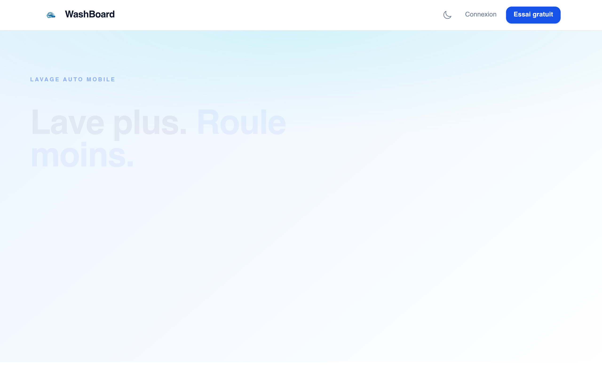

# washboard Design System

You are building UI for **washboard**. Dark-themed, cool palette, sans-serif typography (Geist), compact density on a 4px grid.

## Visual Reference

**IMPORTANT**: Study ALL screenshots below before writing any UI. Match colors, typography, spacing, layout, and motion exactly as shown.

### Homepage



> Read `references/DESIGN.md` for full token details.

## Design Philosophy

- **Layered depth** — use shadow tokens to create a sense of physical layering. Each elevation level has a specific shadow.
- **Gradient accents** — gradients are used thoughtfully for emphasis, not decoration.
- **Single typeface** — Geist carries all text. Hierarchy comes from size, weight, and color — never font mixing.
- **compact density** — 4px base grid. Every dimension is a multiple of 4.
- **cool palette** — the color temperature runs cool, matching the sans-serif typography.
- **Restrained accent** — `#00c4d4` is the only pop of color. Used exclusively for CTAs, links, focus rings, and active states.
- **Subtle motion** — transitions smooth state changes. Keep durations under 300ms, use ease-out curves.

## Color System

### Core Palette

| Role | Token | Hex | Use |
|------|-------|-----|-----|
| Background | `--background` | `#460809` | Page/app background |
| Surface | `--surface` | `#0b1828` | Cards, panels, modals |
| Text Primary | `--text-primary` | `#ffffff` | Headings, body text |
| Accent | `--accent` | `#00c4d4` | CTAs, links, focus rings |

### Status Colors

| Status | Hex | Use |
|--------|-----|-----|
| Success | `#ecfdf5` | Confirmations, positive trends |
| Warning | `#ffedd5` | Caution states, pending items |
| Danger | `#7e2a0c` | Errors, destructive actions |

### Extended Palette

- **color-blue-700:** `#1447e6`
- **color-blue-950:** `#162456`
- **color-slate-800:** `#1d293d`
- **color-red-50:** `#fef2f2` — Light surface or highlight color
- **color-amber-950:** `#461901`
- **color-emerald-950:** `#002c22` — Deep background layer or shadow color
- **color-red-900:** `#82181a`
- **color-blue-500:** `#3080ff`

### CSS Variable Tokens

```css
--background: #f8fafc;
--foreground: #0f172a;
--background: #0f172a;
--foreground: #f1f5f9;
--background: #f8fafc;
--foreground: #0f172a;
--background: #0f172a;
--foreground: #f1f5f9;
--background: #f8fafc;
--foreground: #0f172a;
--background: #0f172a;
--foreground: #f1f5f9;
--background: #f8fafc;
--foreground: #0f172a;
--background: #0f172a;
--foreground: #f1f5f9;
--background: #f8fafc;
--foreground: #0f172a;
--background: #0f172a;
--foreground: #f1f5f9;
```

## Typography

### Font Stack

- **Geist** — Heading 1, Heading 2, Heading 3, Body, Caption
- **Geist Mono** — Code

### Font Sources

```css
@font-face {
  font-family: "Geist";
  src: url("fonts/Geist-Bold.ttf") format("truetype");
  font-weight: 700;
}
@font-face {
  font-family: "Geist";
  src: url("fonts/Geist-Regular.ttf") format("truetype");
  font-weight: 400;
}
@font-face {
  font-family: "Geist Mono";
  src: url("fonts/GeistMono-Bold.ttf") format("truetype");
  font-weight: 700;
}
@font-face {
  font-family: "Geist Mono";
  src: url("fonts/GeistMono-Regular.ttf") format("truetype");
  font-weight: 400;
}
```

### Type Scale

| Role | Family | Size | Weight |
|------|--------|------|--------|
| Heading 1 | Geist | 9rem | 700 |
| Heading 2 | Geist | 0.875rem | 700 |
| Heading 3 | Geist | 0.8125rem | 700 |
| Body | Geist | 11px | 400 |
| Caption | Geist | 10px | 400 |
| Code | Geist Mono | 14px | 400 |

### Typography Rules

- All text uses **Geist** — never add another font family
- Max 3-4 font sizes per screen
- Headings: weight 600-700, body: weight 400
- Use color and opacity for text hierarchy, not additional font sizes
- Line height: 1.5 for body, 1.2 for headings

## Spacing & Layout

### Base Grid: 4px

Every dimension (margin, padding, gap, width, height) must be a multiple of **4px**.

### Spacing Scale

`4, 8, 12, 16, 20, 24, 28, 32, 36, 40, 44, 48` px

### Spacing as Meaning

| Spacing | Use |
|---------|-----|
| 4-8px | Tight: related items (icon + label, avatar + name) |
| 12-16px | Medium: between groups within a section |
| 24-32px | Wide: between distinct sections |
| 48px+ | Vast: major page section breaks |

### Border Radius

Scale: `.25rem, 0.75rem, 4px, 12px`
Default: `4px`

### Container

Max-width: `96rem`, centered with auto margins.

### Breakpoints

| Name | Value |
|------|-------|
| sm | 40rem |
| md | 48rem |
| lg | 64rem |
| xl | 80rem |
| 2xl | 96rem |

Mobile-first: design for small screens, layer on responsive overrides.

## Component Patterns

### Card

```css
.card {
  background: #0b1828;
  border-radius: 4px;
  padding: 16px;
  box-shadow: 0 0 0 3px rgba(22,81,232,0.12);
}
```

```html
<div class="card">
  <h3>Card Title</h3>
  <p>Card content goes here.</p>
</div>
```

### Button

```css
/* Primary */
.btn-primary {
  background: #00c4d4;
  color: #ffffff;
  border-radius: 4px;
  padding: 8px 16px;
  font-weight: 500;
  transition: opacity 150ms ease;
}
.btn-primary:hover { opacity: 0.9; }

/* Ghost */
.btn-ghost {
  background: transparent;
  border: 1px solid #444444;
  color: #ffffff;
  border-radius: 4px;
  padding: 8px 16px;
}
```

```html
<button class="btn-primary">Get Started</button>
<button class="btn-ghost">Learn More</button>
```

### Input

```css
.input {
  background: #460809;
  border: 1px solid #444444;
  border-radius: 4px;
  padding: 8px 12px;
  color: #ffffff;
  font-size: 14px;
}
.input:focus { border-color: #00c4d4; outline: none; }
```

```html
<input class="input" type="text" placeholder="Search..." />
```

### Badge / Chip

```css
.badge {
  display: inline-flex;
  align-items: center;
  padding: 4px 8px;
  border-radius: 9999px;
  font-size: 12px;
  font-weight: 500;
  background: #0b1828;
  color: #8c8c8c;
}
```

```html
<span class="badge">New</span>
<span class="badge">Beta</span>
```

### Modal / Dialog

```css
.modal-backdrop { background: rgba(0, 0, 0, 0.6); }
.modal {
  background: #0b1828;
  border-radius: 12px;
  padding: 24px;
  max-width: 480px;
  width: 90vw;
  box-shadow: 0 4px 24px rgba(22,81,232,0.06);
}
```

```html
<div class="modal-backdrop">
  <div class="modal">
    <h2>Dialog Title</h2>
    <p>Dialog content.</p>
    <button class="btn-primary">Confirm</button>
    <button class="btn-ghost">Cancel</button>
  </div>
</div>
```

### Table

```css
.table { width: 100%; border-collapse: collapse; }
.table th {
  text-align: left;
  padding: 8px 12px;
  font-weight: 500;
  font-size: 12px;
  color: #8c8c8c;
  text-transform: uppercase;
  letter-spacing: 0.05em;
  border-bottom: 1px solid #444444;
}
.table td {
  padding: 12px;
  border-bottom: 1px solid #444444;
}
```

```html
<table class="table">
  <thead><tr><th>Name</th><th>Status</th><th>Date</th></tr></thead>
  <tbody>
    <tr><td>Item One</td><td>Active</td><td>Jan 1</td></tr>
    <tr><td>Item Two</td><td>Pending</td><td>Jan 2</td></tr>
  </tbody>
</table>
```

### Navigation

```css
.nav {
  display: flex;
  align-items: center;
  gap: 8px;
  padding: 12px 16px;
}
.nav-link {
  color: #8c8c8c;
  padding: 8px 12px;
  border-radius: 4px;
  transition: color 150ms;
}
.nav-link:hover { color: #ffffff; }
.nav-link.active { color: #00c4d4; }
```

```html
<nav class="nav">
  <a href="/" class="nav-link active">Home</a>
  <a href="/about" class="nav-link">About</a>
  <a href="/pricing" class="nav-link">Pricing</a>
  <button class="btn-primary" style="margin-left: auto">Get Started</button>
</nav>
```

### Extracted Components

These components were found in the codebase:

**Button** (`html`)

**Navigation** (`html`)

## Page Structure

The following page sections were detected:

- **Navigation** — Top navigation bar (2 items)
- **Hero** — Hero/banner section with headline and CTAs
- **Footer** — Page footer with links and info (6 items)

When building pages, follow this section order and structure.

## Animation & Motion

This project uses **subtle motion**. Transitions smooth state changes without calling attention.

### CSS Animations

- `spin`
- `pulse`
- `washGleam`

### Motion Tokens

- **Duration scale:** `.3s`, `100ms`, `150ms`
- **Animated properties:** `top`

### Motion Guidelines

- **Duration:** Use values from the duration scale above. Short (.3s) for micro-interactions, long (150ms) for page transitions
- **Easing:** `ease-out` for enters, `ease-in` for exits
- **Direction:** Elements enter from bottom/right, exit to top/left
- **Reduced motion:** Always respect `prefers-reduced-motion` — disable animations when set

## Dark Mode

This project supports **light and dark mode** via CSS variables.

### Token Mapping

| Variable | Light | Dark |
|----------|-------|------|
| `--background` | `#f8fafc` | `#0f172a` |
| `--foreground` | `#0f172a` | `#f1f5f9` |

### Implementation

- Toggle via `.dark` class on `<html>` or `[data-theme="dark"]`
- Always use CSS variables for colors — never hardcode hex values
- Test both modes for contrast and readability

## Depth & Elevation

### Shadow Tokens

- Raised (cards, buttons): `0 0 0 3px rgba(22,81,232,0.12)`
- Raised (cards, buttons): `0 0 0 3px rgba(74,129,255,0.15)`
- Overlay (modals, dialogs): `0 4px 24px rgba(22,81,232,0.06)`
- Overlay (modals, dialogs): `0 4px 32px rgba(22,81,232,0.07)`

### Z-Index Scale

`10, 20, 30, 50, 9999`

Use these exact values — never invent z-index values.

## Anti-Patterns (Never Do)

- **No zebra striping** — tables and lists use borders for separation
- **No invented colors** — every hex value must come from the palette above
- **No arbitrary spacing** — every dimension is a multiple of 4px
- **No extra fonts** — only Geist and Geist Mono are allowed
- **No arbitrary border-radius** — use the scale: .25rem, 0.75rem, 4px, 12px
- **No opacity for disabled states** — use muted colors instead
- **No pill shapes** — this design doesn't use rounded-full / 9999px radius

## Workflow

1. **Read** `references/DESIGN.md` before writing any UI code
2. **Pick colors** from the Color System section — never invent new ones
3. **Set typography** — Geist, Geist Mono only, using the type scale
4. **Build layout** on the 4px grid — check every margin, padding, gap
5. **Match components** to patterns above before creating new ones
6. **Apply elevation** — use shadow tokens
7. **Validate** — every value traces back to a design token. No magic numbers.

## Brand Spec

- **Favicon:** `/icon.png`
- **Site URL:** `https://www.washboard.fr/`
- **Brand color:** `#00c4d4`
- **Brand typeface:** Geist

## Quick Reference

```
Background:     #460809
Surface:        #0b1828
Text:           #ffffff / (not extracted)
Accent:         #00c4d4
Border:         (not extracted)
Font:           Geist
Spacing:        4px grid
Radius:         4px
Components:     7 detected
```

## When to Trigger

Activate this skill when:
- Creating new components, pages, or visual elements for washboard
- Writing CSS, Tailwind classes, styled-components, or inline styles
- Building page layouts, templates, or responsive designs
- Reviewing UI code for design consistency
- The user mentions "washboard" design, style, UI, or theme
- Generating mockups, wireframes, or visual prototypes

---

# Full Reference Files

> Every output file is embedded below. Claude has full design system context from /skills alone.

## Design System Tokens (DESIGN.md)

# washboard DESIGN.md

> Auto-generated design system — reverse-engineered via static analysis by skillui.
> Frameworks: None detected
> Colors: 20 · Fonts: 2 · Components: 7
> Icon library: not detected · State: not detected
> Primary theme: dark · Dark mode toggle: yes · Motion: subtle

## Visual Reference

**Match this design exactly** — study colors, fonts, spacing, and component shapes before writing any UI code.


---

## 1. Visual Theme & Atmosphere

This is a **dark-themed** interface with a cool tone. Depth is expressed through layered shadows and subtle surface color variation. Typography uses **Geist** throughout — a clean, modern choice that maintains consistency. Spacing follows a **4px base grid** (compact density), with scale: 4, 8, 12, 16, 20, 24, 28, 32px. The accent color **#00c4d4** anchors interactive elements (buttons, links, focus rings). Motion is subtle — smooth transitions (150-300ms) ease state changes without drawing attention.

---

## 2. Color Palette & Roles

| Token | Hex | Role | Use |
|---|---|---|---|
| color-red-950 | `#460809` | background | Page background, darkest surface |
| color-slate-900 | `#0b1828` | surface | Card and panel backgrounds |
| tw-ring-offset-color | `#ffffff` | text-primary | Headings and body text |
| accent | `#00c4d4` | accent | CTAs, links, focus rings, active states |
| color-orange-900 | `#7e2a0c` | danger | Error states, destructive actions |
| color-emerald-50 | `#ecfdf5` | success | Success states, positive indicators |
| color-orange-100 | `#ffedd5` | warning | Warning states, caution indicators |
| color-blue-700 | `#1447e6` | info | Informational highlights |
| color-blue-950 | `#162456` | unknown | Palette color |
| color-slate-800 | `#1d293d` | unknown | Palette color |
| color-red-50 | `#fef2f2` | unknown | Palette color |
| color-amber-950 | `#461901` | unknown | Palette color |
| color-emerald-950 | `#002c22` | unknown | Palette color |
| color-red-900 | `#82181a` | unknown | Palette color |
| color-blue-500 | `#3080ff` | unknown | Palette color |
| color-blue-900 | `#1c398e` | unknown | Palette color |
| color-emerald-900 | `#004e3b` | unknown | Palette color |
| color-slate-950 | `#020618` | unknown | Palette color |
| unknown | `#6a9fff` | unknown | Palette color |
| color-orange-200 | `#ffd7a8` | unknown | Palette color |

### Dark Mode Token Mapping

| Variable | Light | Dark |
|---|---|---|
| `--background` | `#f8fafc` | `#0f172a` |
| `--foreground` | `#0f172a` | `#f1f5f9` |

### CSS Variable Tokens

```css
--tw-border-style: solid;
--tw-border-style: dashed;
--background: #f8fafc;
--foreground: #0f172a;
--background: #0f172a;
--foreground: #f1f5f9;
--tw-border-style: solid;
--tw-border-style: dashed;
--background: #f8fafc;
--foreground: #0f172a;
--background: #0f172a;
--foreground: #f1f5f9;
--tw-border-style: solid;
--tw-border-style: dashed;
--background: #f8fafc;
--foreground: #0f172a;
--background: #0f172a;
--foreground: #f1f5f9;
--tw-border-style: solid;
--tw-border-style: dashed;
```


---

## 3. Typography Rules

**Font Stack:**
- **Geist** — Heading 1, Heading 2, Heading 3, Body, Caption
- **Geist Mono** — Code

**Font Sources:**

```css
@font-face {
  font-family: "Geist";
  src: url("fonts/Geist-Bold.ttf") format("truetype");
  font-weight: 700;
}
@font-face {
  font-family: "Geist";
  src: url("fonts/Geist-Regular.ttf") format("truetype");
  font-weight: 400;
}
@font-face {
  font-family: "Geist Mono";
  src: url("fonts/GeistMono-Bold.ttf") format("truetype");
  font-weight: 700;
}
@font-face {
  font-family: "Geist Mono";
  src: url("fonts/GeistMono-Regular.ttf") format("truetype");
  font-weight: 400;
}
```

| Role | Font | Size | Weight |
|---|---|---|---|
| Heading 1 | Geist | 9rem | 700 |
| Heading 2 | Geist | 0.875rem | 700 |
| Heading 3 | Geist | 0.8125rem | 700 |
| Body | Geist | 11px | 400 |
| Caption | Geist | 10px | 400 |
| Code | Geist Mono | 14px | 400 |

**Typographic Rules:**
- Use **Geist** for all text — do not mix font families
- Maintain consistent hierarchy: no more than 3-4 font sizes per screen
- Headings use bold (600-700), body uses regular (400)
- Line height: 1.5 for body text, 1.2 for headings
- Use color and opacity for secondary hierarchy, not additional font sizes


---

## 4. Component Stylings

### Layout (1)

**Footer** — `html`

### Navigation (1)

**Navigation** — `html`

### Data Display (1)

**Badge** — `html`

### Data Input (2)

**Button** — `html`
- Animation: 

**Input** — `html`
- State: :focus, :placeholder

### Media (2)

**Image** — `html`

**Icon** — `html`


---

## 5. Layout Principles

- **Base spacing unit:** 4px
- **Spacing scale:** 4, 8, 12, 16, 20, 24, 28, 32, 36, 40, 44, 48
- **Border radius:** .25rem, 0.75rem, 4px, 12px
- **Max content width:** 96rem

**Spacing as Meaning:**
| Spacing | Use |
|---|---|
| 4-8px | Tight: related items within a group |
| 12-16px | Medium: between groups |
| 24-32px | Wide: between sections |
| 48px+ | Vast: major section breaks |


---

## 6. Depth & Elevation

### Raised — cards, buttons, interactive elements

- `0 0 0 3px rgba(22,81,232,0.12)`
- `0 0 0 3px rgba(74,129,255,0.15)`

### Overlay — full-screen overlays, top-level dialogs

- `0 4px 24px rgba(22,81,232,0.06)`
- `0 4px 32px rgba(22,81,232,0.07)`

### Z-Index Scale

`10, 20, 30, 50, 9999`


---

## 7. Animation & Motion

This project uses **subtle motion**. Transitions smooth state changes without demanding attention.

### CSS Animations

- `@keyframes spin`
- `@keyframes pulse`
- `@keyframes washGleam`

### Animated Components

- **Button**: 

### Motion Guidelines

- Duration: 150-300ms for micro-interactions, 300-500ms for page transitions
- Easing: `ease-out` for enters, `ease-in` for exits
- Always respect `prefers-reduced-motion`


---

## 8. Do's and Don'ts

### Do's

- Use `#00c4d4` for interactive elements (buttons, links, focus rings)
- Use `#460809` as the primary page background
- Use **Geist** for all UI text
- Follow the **4px** spacing grid for all margins, padding, and gaps
- Use the defined shadow tokens for elevation — see Section 6
- Use border-radius from the scale: .25rem, 0.75rem, 4px, 12px
- Reuse existing components from Section 4 before creating new ones
- Always use CSS variables for colors — never hardcode hex
- Test both light and dark modes for contrast

### Don'ts

- Don't introduce colors outside this palette — extend the design tokens first
- Don't mix font families — use Geist consistently
- Don't use arbitrary spacing values — stick to multiples of 4px
- Don't create custom box-shadow values outside the system tokens
- Don't use arbitrary border-radius values — pick from the defined scale
- Don't duplicate component patterns — check Section 4 first


---

## 9. Responsive Behavior

| Name | Value | Source |
|---|---|---|
| sm | 40rem | css |
| md | 48rem | css |
| lg | 64rem | css |
| xl | 80rem | css |
| 2xl | 96rem | css |

**Approach:** Use `@media (min-width: ...)` queries matching the breakpoints above.


---

## 10. Agent Prompt Guide

Use these as starting points when building new UI:

### Build a Card

```
Background: #0b1828
Border: 1px solid var(--border)
Radius: 4px
Padding: 16px
Font: Geist
Use shadow tokens from Section 6.
```

### Build a Button

```
Primary: bg #00c4d4, text white
Ghost: bg transparent, border var(--border)
Padding: 8px 16px
Radius: 4px
Hover: opacity 0.9 or lighter shade
Focus: ring with #00c4d4
```

### Build a Page Layout

```
Background: #460809
Max-width: 96rem, centered
Grid: 4px base
Responsive: mobile-first, breakpoints from Section 9
```

### Build a Stats Card

```
Surface: #0b1828
Label: var(--text-muted) (muted, 12px, uppercase)
Value: #ffffff (primary, 24-32px, bold)
Status: use success/warning/danger from Section 2
```

### Build a Form

```
Input bg: #460809
Input border: 1px solid var(--border)
Focus: border-color #00c4d4
Label: var(--text-muted) 12px
Spacing: 16px between fields
Radius: 4px
```

### General Component

```
1. Read DESIGN.md Sections 2-6 for tokens
2. Colors: only from palette
3. Font: Geist, type scale from Section 3
4. Spacing: 4px grid
5. Components: match patterns from Section 4
6. Elevation: shadow tokens
```

## Bundled Fonts (fonts/)

The following font files are bundled in the `fonts/` directory:

- `fonts/Geist-Black.ttf`
- `fonts/Geist-Bold.ttf`
- `fonts/Geist-ExtraBold.ttf`
- `fonts/Geist-ExtraLight.ttf`
- `fonts/Geist-Light.ttf`
- `fonts/Geist-Medium.ttf`
- `fonts/Geist-Regular.ttf`
- `fonts/Geist-SemiBold.ttf`
- `fonts/Geist-Thin.ttf`
- `fonts/GeistMono-Black.ttf`
- `fonts/GeistMono-Bold.ttf`
- `fonts/GeistMono-ExtraBold.ttf`
- `fonts/GeistMono-ExtraLight.ttf`
- `fonts/GeistMono-Light.ttf`
- `fonts/GeistMono-Medium.ttf`
- `fonts/GeistMono-Regular.ttf`
- `fonts/GeistMono-SemiBold.ttf`
- `fonts/GeistMono-Thin.ttf`

Use these local font files in `@font-face` declarations instead of fetching from Google Fonts.

## Homepage Screenshots (screenshots/)


